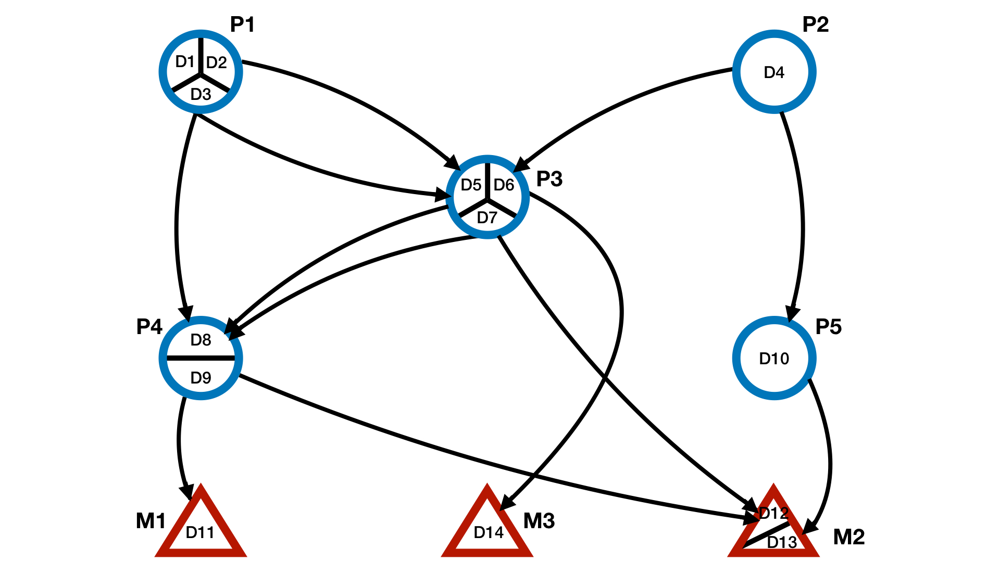
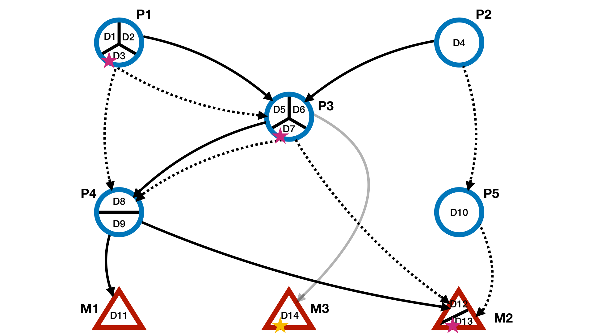

# LINDA Pipeline
The method is used to identify the mechanistic upstream regulatory signalling 
processes that drive gene expression changes by also taking into account the 
contribution of alternative splicing events to signal protein variability and 
information flow modulation. It is a tool that integrates prior knowledge (PKN) 
of directed joint interactions (protein-protein and Domain-Domain interactions 
from DIGGER (Louadi et al. 2021)) with estimated transcription factor enzymatic 
activities from DoRothEA (Garcia-Alonso et al. 2019) and inferred differential 
splicing events from rMATS (Shen et al. 2014). This is achieved by 
contextualising large-scale prior knowledge of joint interactions from 
sequencing data in order to identify a subset of functional interactions between 
proteins and their domains. The pipeline of the method has been depicted in 
**Figure 1**.


{width=100%}


## The inputs of the method consist of the following:

**1.**	From the DoRothEA (Garcia-Alonso et al., 2018) resource, normalized TF 
enrichment scores (NESs) can be estimated with viper (Shen et al. 2014; 
Alvarez et al. 2016). Based on their activities, the most regulated TF’s can 
then be used as the bottom layer of signalling from where we reverse-engineer 
the upstream regulatory interactions.

**2.**	Estimated differential alternative splicing events from two-group 
RNA-Seq data with replicates from rMATS (Shen et al. 2014). The information from 
rMATS that is used in this pipeline is the difference of exon inclusion levels 
between the diseased and health condition. We can refer to this difference value 
as. A negative  indicates a skipping event of an exon/intron in the diseased 
condition compared to healthy. A positive  indicates for a lower exon/intron 
entry on the healthy condition compared to disease. Additionally, the genomic 
coordinates of the exons are provided.

**3.**	A joint network graph from DIGGER (Louadi et al. 2021) that integrates 
PPIs and DDIs and in which nodes represent protein domains defined by 
concatenating Entrez and Pfam id. The resource contains database tables for both 
genomic data, e.g. genes with their corresponding transcript and exon 
coordinates, and for proteins, e.g. isoforms and their domains. The protein 
coordinates were converted to genomic coordinates in the coding sequence and 
both tables are merged to be able to map transcripts with their corresponding 
exons to the corresponding protein isoforms and Pfam domains.

# LINDA Example
Below are provided examples which help the user to better understand the
functioning of the LINDA R-package and the format of the LINDA inputs.

## Toy Example
Below are provided the steps of running a small Toy test study.

### 1. Loading of the required packages
R-packages needed to for the analysis.

```{r, message=FALSE}
library(LINDA)
library(igraph)
library(XML)
```

### 2. Loading of a data-frame containing results from the alternative splicing/exon skipping analysis
It is an object that must contain at least three colums with the following ID's:
**transcript_id:** a transcript ID.
**IncLevelDifference:** an inclusion level difference score normalized between 
-1 and 1 which can be obtained from methods which are used for the detection of
differential AS from replicate RNA-Seq data (i.e. rMATS). This score holds the
difference of exon inclusion levels when comparing two conditions, i.e. Cond1
vs Cond2. A negative score is an indication of a skipping exon in Cond1
compared to Cond2, while a positive score is an indication of a skipping exon
in Cond2 compared to Cond1.
**FDR:** this is as significance value associated with the IncLevelDifference
score. This also can be obtained from differential AS detection tools such as
rMATS.

```{r, warning=FALSE}
load(file = system.file("extdata", "as_data_toy.RData", package = "LINDA"))
print(as.input)
```

### 3. Loading of a data frame of the prior knowledge network of protein-protein (PPI) and domain-domain (DDI) interactions
It is a data-frame object that should contain at lease 6 columns with the 
following ID's:
**gene_source:** gene names of the interaction sources in the PPI.
**gene_target:** gene names of the interaction targets in the PPI.
**pfam_source:** pfam domain ID's of the interaction sources in the DDI.
**pfam_target:** pfam domain ID's of the interaction targets in the DDI.
**exon_source:** transcript ID's mapping to the pfam and protein of the source
interactions. In case multiple transcript ID's map to a domain of a specific
protein, then the multiple transcripts are separated by an underscore symbol.
**exon_target:** transcript ID's mapping to the pfam and protein of the target
interactions. In case multiple transcript ID's map to a domain of a specific
protein, then the multiple transcripts are separated by an underscore symbol.

```{r, warning=FALSE}
load(file = system.file("extdata", "bg_toy.RData", package = "LINDA"))
print(bg)
```

In **Figure 2** is provided a depiction of the Toy case background network.

{width=100%}

### 4. Transcription Factor Activities
It is a data-frame object that should consist of two columns containing the 
estimated transcription factor activities (TF). The data-frame should have 
columns ID's as ```c('id', 'nes')```, indicating to the TF ID's and the
corresponding inferred enrichment score.

```{r, warning=FALSE}
load(file = system.file("extdata", "tf_act_toy.RData", package = "LINDA"))
print(input.scores)
```

### 5. LINDA Analysis

```{r, message=FALSE}
res <- runLINDA(input.scores = input.scores, as.input = as.input, background.network = bg,
solverPath = "~/Downloads/cplex", input.node = NULL, pValThresh = 0.05, top = 2,
lambda1 = 10, lambda2 = 0.001, mipgap = 0.001, relgap = 0.001)

print(res)
```

{width=100%}
